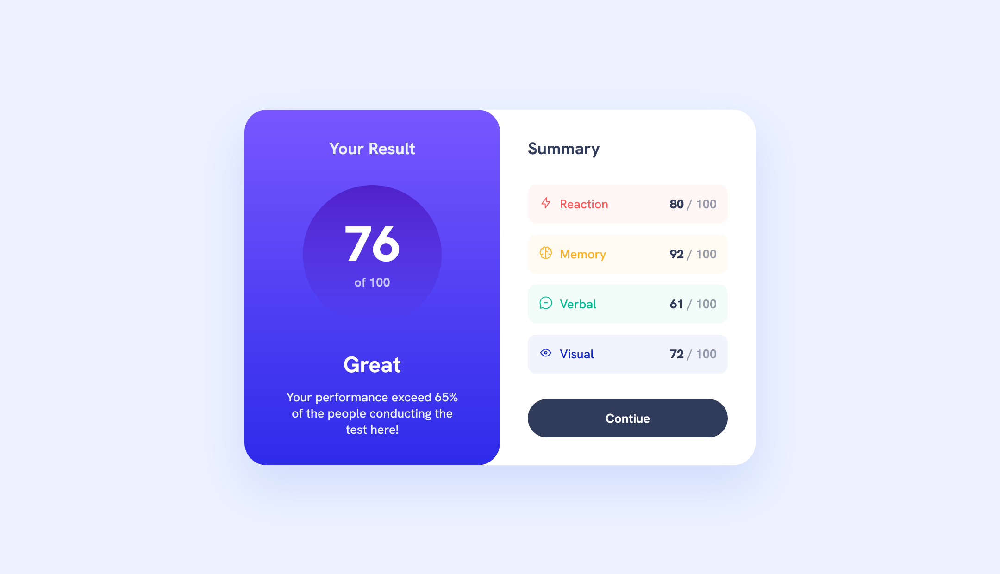

# Frontend Mentor - Results summary component solution

This is a solution to the [Results summary component challenge on Frontend Mentor](https://www.frontendmentor.io/challenges/results-summary-component-CE_K6s0maV).

## Table of contents

- [Overview](#overview)
  - [The challenge](#the-challenge)
  - [Screenshot](#screenshot)
  - [Links](#links)
- [My process](#my-process)
  - [Built with](#built-with)
- [Author](#author)

## Overview

### The challenge

Users should be able to:

- View the optimal layout for the interface depending on their device's screen size
- See hover and focus states for all interactive elements on the page
- **Bonus**: Use the local JSON data to dynamically populate the content

### Screenshot

### Links

- Solution URL: [Github](https://github.com/LuisVera1/FrontendMentor-Results-summary-component)
- Live Site URL: [Solution](https://frontend-mentor-results-summary-component-lilac.vercel.app/)

## My process

### Built with

- Semantic HTML5 markup
- CSS custom properties
- Flexbox
- JavaScript
- Mobile-first workflow
- [React](https://reactjs.org/) - JS library

## Author

- Website - [Luisvera.dev](https://www.luisvera.dev)
- Frontend Mentor -
  [@LuisVera1](https://www.frontendmentor.io/profile/LuisVera1)

